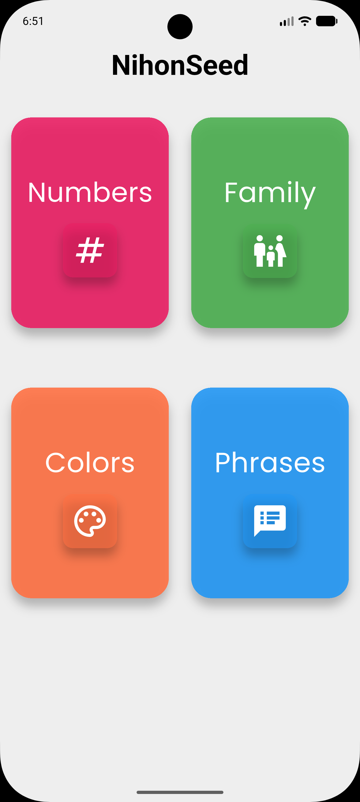
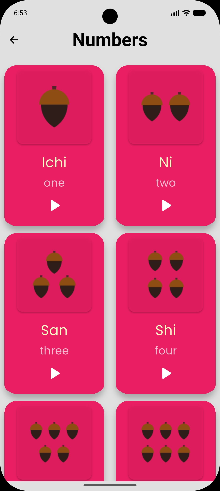
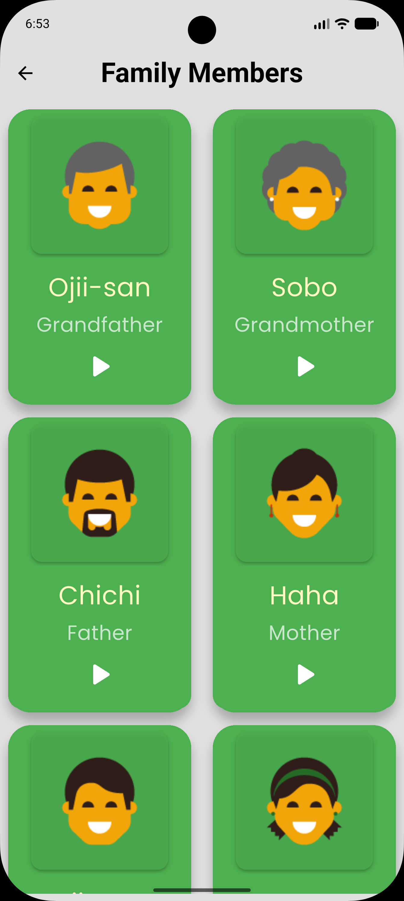
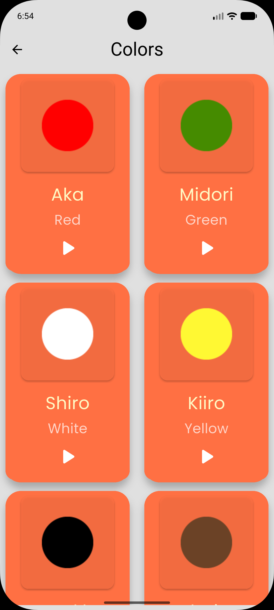
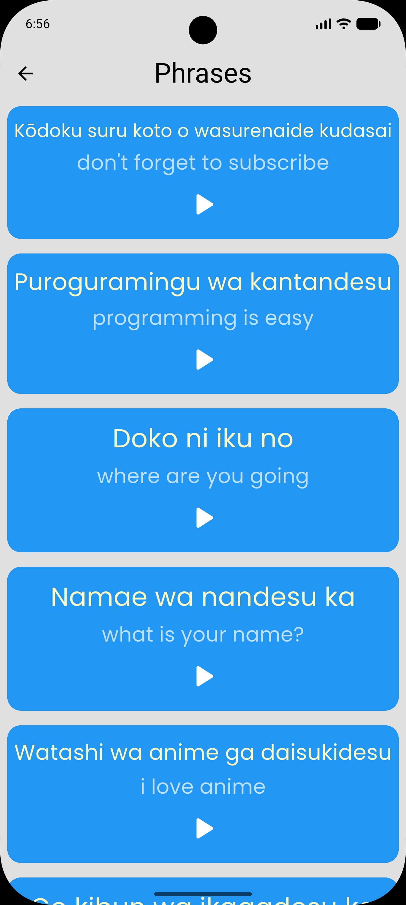
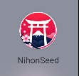
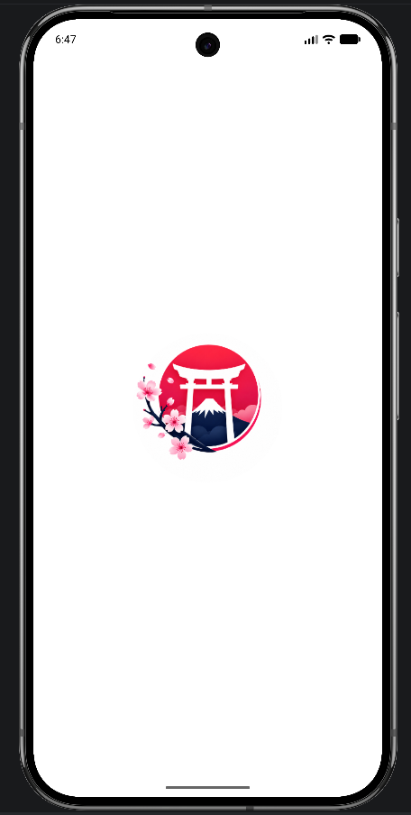

<div align="center">

# 🎌 NihonSeed

[](https://flutter.dev)
[](https://dart.dev)
[](LICENSE)
[](https://flutter.dev)

**An interactive Japanese vocabulary learning app with audio pronunciation, adaptive UI, native splash screen, and adaptive launcher icons**

[📱 Demo](#-demo) • [✨ Features](#-features) • [📸 Screenshots](#-screenshots) • [🏗️ Architecture](#%EF%B8%8F-architecture) • [⚙️ Configuration](#%EF%B8%8F-configuration) • [🚀 Getting Started](#-getting-started)

</div>

---

## 📱 Demo

<div align="center">

### 🎬 Watch the App in Action

**[🔗 Watch on YouTube Shorts](https://youtube.com/shorts/tvvhXTkLd24?si=IYeuk77jfmlK8VhZ)**

*A complete walkthrough of NihonSeed demonstrating all learning categories, audio features, splash screen, and responsive design*

</div>

---

## 🎯 Overview

**NihonSeed** is a beginner-friendly Japanese learning application built with Flutter. It delivers essential vocabulary across four categories—**Numbers**, **Family Members**, **Colors**, and **Phrases**—through an engaging audio-visual card interface.

The app is built with a **component-based architecture**, featuring responsive scaling via `flutter_screenutil`, instant audio playback with `audioplayers`, and polished native branding through `flutter_native_splash` and `flutter_launcher_icons`.

### 💡 Key Highlights
- 🎨 **Category-Based Color Themes** — Unique visual identity for every section
- 🔊 **One-Tap Audio Pronunciation** — Native playback powered by `audioplayers`
- 📐 **Fully Responsive** — Adaptive fonts, spacing, and layouts across all screen sizes
- 🚀 **Native Splash & Icons** — Professional Android 12+ splash screen and adaptive launcher icons
- 🧩 **Modular Components** — Reusable, maintainable widget architecture
- 📱 **Cross-Platform** — Android and iOS support out of the box
- ✨ **Material Design 3** — Modern card-based UI with elevation and rounded corners

---

## ✨ Features

### 🏠 Learning Features
- **Home Screen** — Animated 2-column grid of category cards with icons and color themes
- **Numbers** — Learn counting from 1 (*Ichi*) to 10 (*Juu*) with illustrations
- **Family Members** — Complete family vocabulary from grandfather to daughter
- **Colors** — Essential Japanese colors with visual aids
- **Phrases** — Common conversational expressions for daily use
- **Instant Audio** — Embedded asset audio playback with a single tap

### ⚙️ Technical Features
- **Native Splash Screen** — White-themed splash with centered logo via `flutter_native_splash`
- **Adaptive Launcher Icon** — Android adaptive icons with foreground/background layers via `flutter_launcher_icons`
- **Responsive Layout Engine** — `flutter_screenutil` ensures consistent scaling on any device
- **Reusable Component System** — `DataCard`, `ButtonInfo`, `CategoryCard`, and `ItemListBuilder` used across screens
- **Asset Pipeline** — Organized images, audio files, and custom Poppins font
- **Grid & List Views** — `GridView.builder` for visual categories, `ListView.builder` for text-only phrases

---

## 📸 Screenshots

<div align="center">

### 🖼️ App Screens

| 🏠 Home | 🔢 Numbers | 👨‍👩‍👧‍👦 Family |
|:-------:|:----------:|:--------------:|
|  |  |  |
| Category selection grid | Counting 1–10 | Family vocabulary |

| 🎨 Colors | 💬 Phrases |
|:---------:|:----------:|
|  |  |
| Color learning with images | Audio-only phrase list |

### 🚀 Branding Assets

| 🎨 App Logo | 📱 Splash Screen |
|:-----------:|:----------------:|
|  |  |
| Launcher icon source | Native splash screen |

</div>

---

## 🛠️ Technical Stack

<div align="center">

| Component | Technology | Version | Purpose |
|:---------:|:----------:|:-------:|:-------:|
| **Framework** | Flutter | 3.11.1+ | Cross-platform UI |
| **Language** | Dart | 3.x | Programming |
| **Audio** | audioplayers | ^6.6.0 | Asset audio playback |
| **Responsive** | flutter_screenutil | ^5.9.3 | Adaptive screen & font sizing |
| **Splash** | flutter_native_splash | ^2.4.7 | Native splash generation |
| **Icons** | flutter_launcher_icons | ^0.14.4 | Launcher icon generation |
| **Tooling** | rename | ^3.1.0 | Bundle ID / app name management |
| **Icons (System)** | cupertino_icons | ^1.0.9 | iOS-style system icons |
| **Linting** | flutter_lints | ^6.0.0 | Static analysis |
| **Design** | Material Design 3 | Latest | UI/UX guidelines |
| **Font** | Poppins | Regular | Custom typography |

</div>

---

## 🏗️ Architecture

### 📁 Project Structure

```
lib/
├── main.dart                        # Entry point with ScreenUtilInit
│
├── Models/                          # 📊 Data Models
│   ├── Category_Model.dart          # Category data (name, color, icon, page)
│   └── Data_Models.dart             # Vocabulary data + audio playback logic
│
├── Component/                       # 🧩 Reusable UI Components
│   ├── Button_Info.dart             # Audio action button (Japanese/English + play icon)
│   ├── Data_Card.dart               # Item card (image + ButtonInfo)
│   ├── Item_List_Builder.dart       # Grid layout builder for data items
│   ├── Category_item.dart           # Category card widget (tappable)
│   └── Home_Page_Body.dart          # Home screen grid layout
│
├── Screens/                         # 🎬 UI Screens
│   ├── HomePage.dart                # Main landing with category grid
│   ├── NumbersPage.dart             # Numbers learning screen
│   ├── FamilyPage.dart              # Family learning screen
│   ├── ColorsPage.dart              # Colors learning screen
│   └── phrasesPage.dart             # Phrases learning screen (ListView)
│
└── helper/
    └── constants.dart               # App-wide color constants

assets/
├── app_icons/
│   ├── app_icon.png                 # Launcher icon source
│   └── splash_screen_icon.png       # Splash screen logo
├── images/                          # Category illustrations
│   ├── numbers/
│   ├── family_members/
│   └── colors/
├── sounds/                          # Pronunciation audio files
│   ├── numbers/
│   ├── family_members/
│   ├── colors/
│   └── phrases/
└── fonts/
    └── poppins_regular.ttf          # Custom font
```

### 🔄 Data Flow

```
┌─────────────────┐     ┌──────────────────┐     ┌─────────────────┐
│  CategoryModel  │────▶│    HomePage      │────▶│  HomePageBody   │
│  (name, color,  │     │  (categoryList)  │     │  GridView 2-col │
│   icon, page)   │     └──────────────────┘     └─────────────────┘
└─────────────────┘                                      │
                                                         ▼
                                               ┌─────────────────┐
                                               │  CategoryCard   │
                                               │  (onTap→push)   │
                                               └─────────────────┘
                                                        │
          ┌───────────────┬───────────────┬─────────────┼─────────────┐
          ▼               ▼               ▼             ▼             ▼
   ┌─────────────┐ ┌─────────────┐ ┌─────────────┐ ┌─────────────┐
   │ NumbersPage │ │  FamilyPage │ │  ColorsPage │ │ PhrasesPage │
   │GridView 2-col│ │GridView 2-col│ │GridView 2-col│ │ListView     │
   └─────────────┘ └─────────────┘ └─────────────┘ └─────────────┘
          │               │               │             │
          └───────────────┴───────────────┘             │
                          │                             │
                          ▼                             ▼
                   ┌─────────────────┐          ┌─────────────────┐
                   │    DataCard     │          │    ButtonInfo   │
                   │ (Image+Button)  │          │  (Text+Play)    │
                   └─────────────────┘          └─────────────────┘
                          │                             │
                          ▼                             ▼
                   ┌─────────────────┐          ┌─────────────────┐
                   │   ButtonInfo    │          │   DataModel     │
                   │  (Play Action)  │          │  .playSound()   │
                   └─────────────────┘          │  AudioPlayer()  │
                                                └─────────────────┘
```

**Navigation:** Standard Flutter `Navigator.push` with `MaterialPageRoute`
```dart
Navigator.push(
  context,
  MaterialPageRoute(builder: (context) => model.page),
);
```

---

## ⚙️ Configuration

### 🎨 Native Splash Screen

Configuration: `flutter_native_splash.yaml`

```yaml
flutter_native_splash:
  color: "#FFFFFF"
  image: assets/app_icons/splash_screen_icon.png

  android_12:
    color: "#FFFFFF"
    image: assets/app_icons/splash_screen_icon.png
```

| Property | Value | Description |
|:---------|:------|:------------|
| **Background** | `#FFFFFF` | Pure white splash background |
| **Logo** | `splash_screen_icon.png` | Centered icon for all platforms |
| **Android 12+** | Supported | Themed splash with centered icon clipped to a circle |

**Generate splash assets:**
```bash
dart run flutter_native_splash:create
```

### 🚀 Launcher Icons

Configuration: `flutter_launcher_icons.yaml`

```yaml
flutter_launcher_icons:
  image_path: "assets/app_icons/app_icon.png"
  android: "launcher_icon"
  min_sdk_android: 21
  adaptive_icon_background: "#FFFFFF"
  adaptive_icon_foreground: "assets/app_icons/app_icon.png"
```

| Property | Value | Description |
|:---------|:------|:------------|
| **Standard Icon** | `app_icon.png` | Used across all platforms |
| **Android Adaptive** | White background + foreground icon | Supports Android 8.0+ adaptive icons |
| **Min SDK** | 21 | Minimum Android API level |

**Generate launcher icons:**
```bash
dart run flutter_launcher_icons
```

---

## 🎨 Design System

### Color Palette
| Category | Hex Code | Preview | Usage |
|:---------|:--------:|:-------:|:------|
| **Numbers** | `#E91E63` | 🩷 | Numbers category theme |
| **Family** | `#4CAF50` | 💚 | Family category theme |
| **Colors** | `#FF7043` | 🧡 | Colors category theme |
| **Phrases** | `#2196F3` | 💙 | Phrases category theme |
| **Background** | `#E0E0E0` | ⬜ | App scaffold background |
| **Surface** | `#FFFFFF` | ⬜ | Card surfaces |
| **Text Primary** | `#FFFFFF` | ⬜ | Card titles |
| **Text Secondary** | `#B3FFFFFF` | ⬜ | Subtitle text (70% white) |
| **Japanese Accent** | `#FFFFEE` | 🟡 | Japanese word highlight |

### Typography
- **Font Family:** Poppins (Regular)
- **Category Names:** Bold, 28.sp, White
- **Japanese Words:** Medium, 23.sp, Yellow tint (`Colors.yellow[100]`)
- **English Words:** Regular, 18.sp, White 70%
- **AppBar Titles:** Bold, 30.sp, Black

### Shape & Elevation
- **Cards:** `BorderRadius.circular(25)` — 25px corner radius
- **Buttons:** `BorderRadius.circular(15)` — 15px corner radius
- **Card Elevation:** 10
- **Inner Card Elevation:** 2

---

## 🧩 Data Models

### CategoryModel
Defines a learnable category displayed on the home screen.

```dart
class CategoryModel {
  final String name;      // Display name (e.g., "Numbers")
  final int color;        // Theme color (ARGB hex int)
  final Icon icon;        // Category icon widget
  final Widget page;      // Target screen widget

  CategoryModel({
    required this.name,
    required this.color,
    required this.icon,
    required this.page,
  });
}
```

### DataModel
Defines a vocabulary item with optional image and audio playback.

```dart
class DataModel {
  String japaneseWord;    // Japanese text (Romaji)
  String englishWord;     // English translation
  String? imagePath;      // Asset image path (nullable for phrases)
  String sound;           // Asset audio path

  DataModel({
    required this.japaneseWord,
    required this.englishWord,
    this.imagePath,
    required this.sound,
  });

  void playSound() {
    final player = AudioPlayer();
    player.play(AssetSource(sound));
  }
}
```

---

## 📚 Content Reference

### 🔢 Numbers (1–10)

| # | Japanese | Romaji | English |
|:---:|:---|:---|:---|
| 1 | 一 | Ichi | One |
| 2 | 二 | Ni | Two |
| 3 | 三 | San | Three |
| 4 | 四 | Shi | Four |
| 5 | 五 | Go | Five |
| 6 | 六 | Roku | Six |
| 7 | 七 | Nana | Seven |
| 8 | 八 | Hachi | Eight |
| 9 | 九 | Kyu | Nine |
| 10 | 十 | Juu | Ten |

### 👨‍👩‍👧‍👦 Family Members

| Japanese | Romaji | English |
|:---|:---|:---|
| お爺さん | Ojii-san | Grandfather |
| 祖母 | Sobo | Grandmother |
| 父 | Chichi | Father |
| 母 | Haha | Mother |
| 兄さん | Nii-san | Older Brother |
| 姉 | Ane | Older Sister |
| 弟 | Otouto | Younger Brother |
| 妹 | Imouto | Younger Sister |
| 息子 | Musuko | Son |
| 娘 | Musume | Daughter |

### 🎨 Colors

| Japanese | Romaji | English |
|:---|:---|:---|
| 赤 | Aka | Red |
| 緑 | Midori | Green |
| 白 | Shiro | White |
| 黄色 | Kiiro | Yellow |
| ブラック | Burakku | Black |
| 茶色 | Chairo | Brown |
| グレー | Gurē | Gray |

### 💬 Common Phrases

| Japanese | Romaji | English |
|:---|:---|:---|
| 購読することを忘れないでください | Kōdoku suru koto o wasurenaide kudasai | Don't forget to subscribe |
| プログラミングは簡単です | Puroguramingu wa kantandesu | Programming is easy |
| どこに行くの | Doko ni iku no | Where are you going |
| 名前は何ですか | Namae wa nandesu ka | What is your name? |
| 私はアニメが大好きです | Watashi wa anime ga daisukidesu | I love anime |
| ご気分はいかがですか | Go kibun wa ikagadesu ka | How are you feeling? |
| 来ますか | Kimasu ka | Are you coming? |
| はい、行きます | Hai, ikimasu | Yes, I'm coming |

---

## 📦 Dependencies

```yaml
dependencies:
  flutter:
    sdk: flutter
  audioplayers: ^6.6.0
  cupertino_icons: ^1.0.9
  flutter_native_splash: ^2.4.7
  flutter_launcher_icons: ^0.14.4
  rename: ^3.1.0
  flutter_screenutil: ^5.9.3

dev_dependencies:
  flutter_test:
    sdk: flutter
  flutter_lints: ^6.0.0
```

```bash
flutter pub get
```

---

## 🚀 Getting Started

### 📋 Prerequisites

| Requirement | Version | Purpose |
|:-----------:|:-------:|:-------:|
| Flutter SDK | >=3.11.1 | Framework |
| Dart SDK | >=3.0.0 | Language |
| Android Studio / Xcode | Latest | IDEs & Emulators |

### 💻 Installation

```bash
# 1. Clone repository
git clone https://github.com/ahmed-el-bialy/nihon-seed.git
cd nihon-seed

# 2. Install dependencies
flutter pub get

# 3. Generate native splash screen
dart run flutter_native_splash:create

# 4. Generate launcher icons
dart run flutter_launcher_icons

# 5. Run application
flutter run

# Build for production
flutter build apk --release          # Android APK
flutter build appbundle --release    # Android AAB
flutter build ios --release          # iOS
```

---

## 🔍 Code Quality Notes

The codebase follows a clean component-based architecture with consistent use of `flutter_screenutil` for responsive design. Recent updates have resolved previous UI inconsistencies, ensuring uniform border radii and responsive units across all screens.

| Area | Status | Notes |
|:-----|:------:|:------|
| **Border Radii** | ✅ Resolved | `BorderRadius.circular()` used consistently across all cards and containers |
| **Responsive Units** | ✅ Resolved | `.sp`, `.w`, `.h`, `.r` applied uniformly across all pages |
| **Audio Lifecycle** | 🟡 Review | Consider using a single `AudioPlayer` instance or disposing players after playback to optimize memory |
| **Const Constructors** | 🟢 Good | `const` applied to stateless widgets where applicable |
| **Asset Handling** | 🟢 Good | Well-organized asset directories for images, audio, and fonts |

---

## 🔮 Roadmap

- [ ] **Global Audio Manager** — Single `AudioPlayer` instance with lifecycle management
- [ ] **Favorites System** — Persist saved words with `Hive` or `SharedPreferences`
- [ ] **Search Functionality** — Filter vocabulary by Japanese or English
- [ ] **Dynamic Content** — Load data from JSON/API instead of hardcoded lists
- [ ] **Quiz Mode** — Interactive scoring system
- [ ] **Progress Tracking** — Statistics dashboard
- [ ] **Additional Categories** — Animals, Food, Weather, etc.
- [ ] **Dark Mode** — Full theme switching support
- [ ] **Unit & Widget Tests** — Comprehensive test coverage
- [ ] **CI/CD** — GitHub Actions for automated builds

---

## 🤝 Contributing

Contributions are welcome!

1. **Fork** the repository
2. **Create** a feature branch: `git checkout -b feature/amazing-feature`
3. **Commit** changes: `git commit -m 'feat: Add amazing feature'`
4. **Push** to branch: `git push origin feature/amazing-feature`
5. **Open** a Pull Request

---

## 📄 License

This project is licensed under the **MIT License** — see the [LICENSE](LICENSE) file for details.

---

## 👤 Author

**Ahmed El-Bialy**  
*Flutter Developer | Mobile App Specialist*

<div align="center">

[](https://www.linkedin.com/in/ahmedel-bialy/)
[](mailto:ah.elbialy.dev@gmail.com)
[](tel:+201022121573)
[](https://github.com/ahmed-el-bialy)

</div>

📧 **Email:** ah.elbialy.dev@gmail.com  
📞 **Phone:** +20 102 212 1573

---

<div align="center">

### ⭐ Star this repo if you found it helpful!

**Built with ❤️ by Ahmed El-Bialy**

</div>
